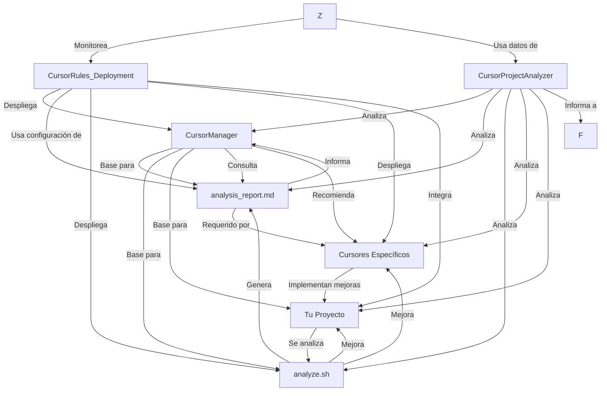

# CursorManager: Gestor Central de Guías de Desarrollo

## Descripción

CursorManager actúa como un orquestador central para todos los cursores especializados de tu proyecto. Este gestor está diseñado para funcionar en conjunto con el script `analyze.sh` para proporcionar información en tiempo real sobre el estado de tu proyecto.

## Análisis en Tiempo Real

Para obtener un análisis actualizado de tu proyecto:

```bash
# Otorgar permisos de ejecución: Abre una terminal en la raíz de tu proyecto y ejecuta:
chmod +x analyze.sh
# Ejecuta el script de análisis

./analyze.sh

# Revisa el reporte generado
cat analysis_report.md

## Arquitectura General del Proyecto

```
AI Task Manager
├── Frontend (Next.js + TypeScript + Tailwind + Shadcn)
├── Backend
│   ├── Supabase (Base de datos y autenticación)
│   ├── APIs
│   │   ├── OpenRouter (IA - Qwen)
│   │   ├── Google (Auth + Calendar)
│   │   └── PayPal (Procesamiento de pagos)
│   └── Edge Functions (Serverless)
└── Integraciones
    ├── Autenticación con Google
    ├── Google Calendar
    ├── IA con Qwen/OpenRouter
    └── Procesamiento de pagos con PayPal
```

## Guías Especializadas Disponibles

| Guía Especializada | Enfoque | Cuándo usarla |
|------------|---------|--------|-------------|
| [.CursorRules_Supabase.md](./.CursorRules_Supabase.md) | Base de datos, autenticación, tiempo real | Para todo lo relacionado con persistencia de datos y manejo del backend |
| [.CursorRules_GoogleAuth.md](./.CursorRules_GoogleAuth.md) | Autenticación con Google | Cuando necesites implementar login con Google y manejo de sesiones |
| [.CursorRules_GoogleCalendar.md](./.CursorRules_GoogleCalendar.md) | Integración con Calendario | Para sincronizar tareas con el calendario de Google del usuario |
| [.CursorRules_PayPal.md](./.CursorRules_PayPal.md) | Procesamiento de pagos | Al implementar suscripciones o pagos puntuales para planes Premium |
| [.IA_Implementacion.md](./.IA_Implementacion.md) | Funcionalidades de IA con Qwen | Para todas las características inteligentes de la aplicación |
| [.CursorRules_ProjectStatus.md](./.CursorRules_ProjectStatus.md) | Monitoreo y estado del proyecto | Para verificar el estado general y obtener recomendaciones de acción |
| [.CursorRules_Deployment.md](./.CursorRules_Deployment.md) | Despliegue del SaaS | Para desplegar la aplicación usando Supabase, Vercel y Railway |
| [.CursorProjectAnalyzer.md](./CursorProjectAnalyzer.md) | Análisis de código real | Para obtener insights basados en tu implementación actual |

## Problemas Prioritarios

Según el estado actual, estos son los problemas más importantes a resolver:

1. **🟡 [P001]** Tiempos de respuesta elevados en IA - Ver [.IA_Implementacion.md](./.IA_Implementacion.md)
2. **🟡 [P003]** Renovación de tokens en Calendar - Ver [.CursorRules_GoogleCalendar.md](./.CursorRules_GoogleCalendar.md)
3. **🟢 [P002]** Optimización de índices en base de datos - Ver [.CursorRules_Supabase.md](./.CursorRules_Supabase.md)

## Flujo de Desarrollo Recomendado

1. **Configuración Inicial** ✅
   - Iniciar con Supabase para la base de datos y estructura del backend ✅
   - Implementar autenticación con Google para gestión de usuarios ✅

2. **Desarrollo de Features Core** 🟡
   - Implementar funcionalidades básicas de gestión de tareas ✅
   - Integrar IA para asistencia en tareas y productividad 🟡

3. **Integraciones Avanzadas** 🟡
   - Conectar con Google Calendar para sincronización de tareas 🟡
   - Implementar sistema de pagos para planes premium ⚪

4. **Despliegue y Monetización** ⚪
   - Desplegar en plataformas recomendadas ⚪
   - Implementar planes de suscripción ⚪

## Matriz de Decisión para Selección de Cursores
| Si el análisis muestra... | Consulta... | Para... |
|-----------|-------------------|-----------------|
|Problemas con renovación de tokens|.CursorRules_GoogleCalendar.md|Implementar renovación automática|
|Problemas con tiempos de IA|.IA_Implementacion.md|Optimizar llamadas a OpenRouter|
|Problemas con base de datos|.CursorRules_Supabase.md|Optimizar índices y consultas|
|Necesidad de despliegue|.CursorRules_Deployment.md|Configurar Vercel, Supabase, Railway|

Usa esta matriz para determinar qué cursor necesitas según la fase de desarrollo:

| Necesidad | Cursor Recomendado | Consideraciones |
|-----------|-------------------|-----------------|
| Verificar estado del proyecto | CursorRules_ProjectStatus | Utiliza los comandos `status check` para obtener el estado actual |
| Estructurar base de datos | CursorRules_Supabase | Necesitarás definir el esquema de datos antes de cualquier otra cosa |
| Login con redes sociales | CursorRules_GoogleAuth | Asegúrate de tener las credenciales de API creadas en Google Cloud |
| Feature: Sugerencias IA | IA_Implementacion | Requiere una cuenta en OpenRouter y configurar acceso a Qwen |
| Feature: Sincronización con calendario | CursorRules_GoogleCalendar | Depende de tener la autenticación con Google ya implementada |
| Feature: Planes de pago | CursorRules_PayPal | Es mejor dejarlo para después de tener las funcionalidades core |
| Desplegar el SaaS | CursorRules_Deployment | Asegúrate de tener todas las dependencias configuradas primero |

## Mapa de Dependencias entre Cursores



## Comandos de Consulta Rápida

Para acceder rápidamente al cursor que necesitas:

```bash
# Analizar el estado actual del proyecto
./analyze.sh

# Verificar el estado del proyecto
consultar .CursorRules_ProjectStatus.md

# Crear una nueva tabla en Supabase
consultar .CursorRules_Supabase.md "CREATE TABLE"

# Implementar login con Google
consultar .CursorRules_GoogleAuth.md "Configuración en Google Cloud Console"

# Resolver problema de tokens en Calendar
consultar .CursorRules_GoogleCalendar.md "Renovación de tokens"

# Configurar pagos
consultar .CursorRules_PayPal.md "Cliente de PayPal"

# Implementar features de IA
consultar .IA_Implementacion.md "Funcionalidades de IA"

# Desplegar el SaaS
consultar .CursorRules_Deployment.md "Proceso de Despliegue"

```

## Gestión de Versiones y Fases

### Fase 1: MVP (Minimum Viable Product) 🟡
- **Cursores necesarios:**
  - CursorRules_Supabase (esquema básico) ✅
  - CursorRules_GoogleAuth (login básico) ✅
  - IA_Implementacion (funcionalidades básicas) 🟡

### Fase 2: Producto Completo 🟡
- **Cursores adicionales:**
  - CursorRules_GoogleCalendar 🟡
  - Expansión de CursorRules_Supabase para métricas y analytics 🟡

### Fase 3: Monetización y Despliegue ⚪
- **Cursores adicionales:**
  - CursorRules_PayPal ⚪
  - CursorRules_Deployment ⚪
  - Expansión de todos los cursores para soportar planes de suscripción ⚪

## Checklist de Implementación

- [x] **Configuración Inicial**
  - [x] Esquema de base de datos Supabase
  - [x] Configuración de autenticación

- [ ] **Features Core**
  - [x] CRUD de tareas
  - [x] Categorización y organización
  - [ ] Integración de IA para recomendaciones

- [ ] **Integraciones**
  - [ ] Google Calendar
  - [ ] Sistema de pagos

- [ ] **Optimizaciones**
  - [ ] Rendimiento frontend
  - [ ] Costos de API de IA
  - [ ] Seguridad y privacidad

- [ ] **Despliegue**
  - [ ] Configuración de Supabase en producción
  - [ ] Configuración de Vercel para frontend
  - [ ] Configuración de Railway (si es necesario)
  - [ ] Dominios personalizados y SSL

## Cómo Utilizar el Monitoreo del Proyecto

1. **Verificar estado general:**
   ```
   status check
   ```

2. **Verificar componente específico:**
   ```
   status check ia
   ```

3. **Consultar problemas actuales:**
   ```
   grep_search "Problemas Activos" CursorRules_ProjectStatus.md
   ```

4. **Actualizar estado después de resolver un problema:**
   ```
   status resolve P001
   ```

## Ejemplo de Uso del CursorManager

### Escenario 1: Inicio del Proyecto

**Pregunta al CursorManager:** "Necesito empezar el proyecto de AI Task Manager, ¿por dónde comienzo?"

**Respuesta:**
1. Comienza con CursorRules_Supabase.md para configurar la base de datos
2. Implementa el esquema básico para tareas y usuarios
3. Luego configura la autenticación con CursorRules_GoogleAuth.md

### Escenario 2: Implementación de Feature Específica

**Pregunta al CursorManager:** "Quiero que las tareas se sincronicen con Google Calendar"

**Respuesta:**
1. Asegúrate de tener implementada la autenticación con Google (CursorRules_GoogleAuth.md)
2. Consulta CursorRules_GoogleCalendar.md, sección "Cliente de Google Calendar"
3. Implementa primero la funcionalidad de lectura de eventos
4. Luego añade la sincronización bidireccional

### Escenario 3: Problema Técnico

**Pregunta al CursorManager:** "Tengo un error en las políticas de seguridad de Supabase"

**Respuesta:**
1. Consulta CursorRules_Supabase.md, sección "RLS (Row Level Security)"
2. Verifica que estás siguiendo las mejores prácticas de definición de políticas
3. Implementa las políticas recomendadas para la tabla específica donde tienes el error

### Escenario 4: Verificación de Estado

**Pregunta al CursorManager:** "¿Cuál es el estado actual del proyecto y qué debería priorizar?"

**Respuesta:**
1. El estado general es 🟡 Atención Requerida (62% completado)
2. Deberías priorizar la implementación del sistema de caché para IA (P001)
3. Consulta CursorRules_ProjectStatus.md para ver todos los detalles del estado
4. Ejecuta `status check` para obtener información en tiempo real

### Escenario 5: Despliegue del SaaS

**Pregunta al CursorManager:** "Quiero desplegar mi aplicación como un SaaS usando Supabase, Vercel y Railway"

**Respuesta:**
1. Verifica que todas las funcionalidades principales estén implementadas y probadas
2. Consulta CursorRules_Deployment.md para obtener instrucciones detalladas
3. Sigue el proceso de despliegue comenzando por Supabase, luego Railway y finalmente Vercel
4. Usa la lista de verificación pre-lanzamiento para asegurarte de no olvidar nada importante

## Consideraciones Especiales por Dominio

### Backend (Supabase)
- Mantén el número de tablas optimizado para evitar complejidad innecesaria
- Utiliza RLS para seguridad desde el inicio
- Configura índices para consultas frecuentes

### Autenticación
- Solicita solo los permisos mínimos necesarios en OAuth
- Implementa manejo de tokens adecuado
- Asegura rutas protegidas con middleware

### IA
- Optimiza los prompts para Qwen para reducir costos
- Implementa caché para respuestas comunes
- Monitorea el uso para evitar sorpresas en facturación

### Pagos
- Comienza con la integración sandbox
- Implementa idempotencia para evitar pagos duplicados
- Mantén registros detallados de transacciones

### Despliegue
- Sigue la arquitectura recomendada (Supabase + Vercel + Railway)
- Implementa CI/CD desde el principio
- Configura monitoreo y alertas para detectar problemas rápidamente
- Mantén un plan de backup y recuperación bien definido

## Resumen

El CursorManager te ayudará a navegar las diferentes guías especializadas según la etapa de desarrollo en la que te encuentres, ahora con monitoreo de estado integrado gracias a CursorRules_ProjectStatus y opciones de despliegue con CursorRules_Deployment. Consúltalo cuando:

1. No sepas por dónde empezar
2. Necesites implementar una feature específica
3. Tengas un problema técnico concreto
4. Necesites entender dependencias entre componentes
5. Quieras verificar el estado del proyecto y priorizar tareas
6. Estés listo para desplegar tu aplicación como un SaaS

Recuerda que cada cursor está especializado en un dominio específico pero todos trabajan juntos para crear una aplicación cohesiva y bien integrada.
