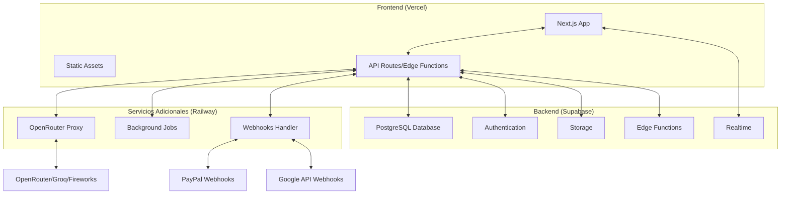

# CursorRules_Deployment: Guía de Despliegue del SaaS

## Descripción

Este cursor proporciona instrucciones detalladas para desplegar tu aplicación AI Task Manager como un SaaS (Software as a Service) utilizando las siguientes plataformas:

- **Supabase**: Para base de datos, autenticación y almacenamiento
- **Vercel**: Para el despliegue del frontend (Next.js)
- **Railway**: Para servicios backend adicionales (si son necesarios)

Esta guía te llevará a través del proceso completo desde la configuración inicial hasta el despliegue en producción, incluyendo la configuración de dominios personalizados, CI/CD y monitoreo.

## Arquitectura de Despliegue



## 1. Preparación para el Despliegue

### 1.1 Verificación de Requisitos

Antes de comenzar el despliegue, asegúrate de tener:

- [x] Código fuente funcional en un repositorio Git (GitHub recomendado)
- [x] Estructura de base de datos definida y probada localmente
- [x] Variables de entorno identificadas y documentadas
- [x] Archivos de configuración para cada plataforma (.gitignore, vercel.json, etc.)
- [x] Pruebas básicas para verificar la funcionalidad post-despliegue

### 1.2 Planificación de Entornos

Para un SaaS profesional, se recomienda configurar tres entornos:

1. **Desarrollo**: Para pruebas durante el desarrollo
2. **Staging/Pruebas**: Para QA y validación antes de producción
3. **Producción**: Entorno para usuarios finales

## 2. Configuración de Supabase

### 2.1 Crear un Proyecto en Supabase

1. Inicia sesión en [Supabase](https://app.supabase.com/)
2. Haz clic en "New Project"
3. Completa la información:
   - **Name**: `ai-task-manager` (o tu nombre preferido)
   - **Database Password**: Genera una contraseña segura y guárdala
   - **Region**: Selecciona la más cercana a tus usuarios objetivo
   - **Pricing Plan**: Comienza con Free, actualiza según necesidad

### 2.2 Configuración del Esquema de Base de Datos

Existen dos enfoques para configurar tu esquema:

#### Opción 1: Migración mediante SQL (Recomendado para producción)

```bash
# Instalar CLI de Supabase
npm install -g supabase

# Login a Supabase
supabase login

# Inicializar en el proyecto
cd ai-task-manager
supabase init

# Generar migración basada en tu esquema local
supabase db diff -f initial_schema

# Aplicar a proyecto remoto
supabase db push
```

#### Opción 2: Uso del Editor SQL en Dashboard

1. Ve a la sección SQL Editor en el Dashboard de Supabase
2. Copia y pega el esquema SQL de `CursorRules_Supabase.md`
3. Ejecuta el script SQL

### 2.3 Configuración de Autenticación

1. En el Dashboard de Supabase, navega a "Authentication" → "Providers"
2. Habilita los métodos necesarios:
   - Email (Password / Magic Link)
   - Google (requiere configuración en Google Cloud Console)
3. Configura las URLs de redirección:
   ```
   https://[tu-app].vercel.app/api/auth/callback
   https://[tu-dominio-personalizado]/api/auth/callback
   ```

### 2.4 Configuración de Almacenamiento (si es necesario)

1. Ve a "Storage" en el Dashboard de Supabase
2. Crea un nuevo bucket: `task-attachments`
3. Configura las políticas de seguridad:
   ```sql
   -- Permitir a usuarios autenticados leer sus propios archivos
   CREATE POLICY "Allow users to read own attachments"
   ON storage.objects FOR SELECT
   USING (auth.uid() = owner_id);

   -- Permitir a usuarios autenticados cargar archivos
   CREATE POLICY "Allow users to upload own attachments"
   ON storage.objects FOR INSERT
   WITH CHECK (auth.uid() = owner_id);
   ```

### 2.5 Configuración de Edge Functions (opcional)

Si necesitas funciones específicas para el backend:

1. Navega a "Edge Functions" en el Dashboard
2. Crea una nueva función, por ejemplo para procesamiento de IA:
   ```bash
   supabase functions new process-ai-task
   ```
3. Implementa la lógica en el archivo generado
4. Despliega la función:
   ```bash
   supabase functions deploy process-ai-task
   ```

## 3. Despliegue en Vercel

### 3.1 Preparación del Proyecto Next.js

Asegúrate de que tu proyecto tenga los siguientes archivos:

#### vercel.json
```json
{
  "buildCommand": "npm run build",
  "outputDirectory": ".next",
  "devCommand": "npm run dev",
  "installCommand": "npm install",
  "framework": "nextjs",
  "environment": {
    "NEXT_PUBLIC_SUPABASE_URL": "Sensitive",
    "NEXT_PUBLIC_SUPABASE_ANON_KEY": "Sensitive",
    "OPENROUTER_API_KEY": "Sensitive"
  }
}
```

#### .gitignore
```
.vercel
.env
.env.local
.env.development.local
.env.test.local
.env.production.local
node_modules
.next
out
```

### 3.2 Configuración en Vercel

1. Inicia sesión en [Vercel](https://vercel.com/)
2. Haz clic en "Add New" → "Project"
3. Importa tu repositorio de GitHub
4. Configura las variables de entorno:
   - `NEXT_PUBLIC_SUPABASE_URL` (desde Supabase Dashboard)
   - `NEXT_PUBLIC_SUPABASE_ANON_KEY` (desde Supabase Dashboard)
   - `OPENROUTER_API_KEY` (desde tu cuenta en OpenRouter)
   - `NEXTAUTH_URL` (URL de tu aplicación)
   - `NEXTAUTH_SECRET` (generado con `openssl rand -base64 32`)
   - Otras variables específicas de tu aplicación
5. Ajusta la configuración de compilación (si es necesario)
6. Haz clic en "Deploy"

### 3.3 Configuración de Dominio Personalizado

1. En el Dashboard de Vercel, ve a la sección "Domains"
2. Haz clic en "Add" e ingresa tu dominio
3. Sigue las instrucciones para configurar los registros DNS
4. Configura SSL automático (habilitado por defecto)

### 3.4 Configuración de CI/CD

El CI/CD está automáticamente configurado cuando conectas tu repositorio a Vercel. Para personalizarlo:

1. Crea o edita `.github/workflows/ci.yml` para pruebas adicionales
2. Configura verificaciones de pull request en GitHub
3. Considera agregar pruebas de integración

## 4. Configuración en Railway (para servicios backend adicionales)

Si necesitas servicios que no son proporcionados por Supabase o que requieren más capacidad de procesamiento:

### 4.1 Configuración del Proyecto en Railway

1. Inicia sesión en [Railway](https://railway.app/)
2. Crea un nuevo proyecto: "New Project" → "Deploy from GitHub repo"
3. Selecciona el repositorio relevante (puede ser un repo separado para servicios backend)

### 4.2 Configuración de Servicios

Railway te permite configurar varios servicios. Ejemplos comunes:

#### Proxy para IA (para gestionar tokens OpenRouter)
```yaml
# railway.json para un proxy de IA
{
  "build": {
    "builder": "NIXPACKS",
    "buildCommand": "npm install"
  },
  "deploy": {
    "startCommand": "node proxy-server.js",
    "healthcheckPath": "/health",
    "healthcheckTimeout": 100,
    "restartPolicyType": "ON_FAILURE"
  }
}
```

#### Worker para procesamiento en segundo plano
```yaml
# railway.json para un worker de tareas
{
  "build": {
    "builder": "NIXPACKS",
    "buildCommand": "npm install"
  },
  "deploy": {
    "startCommand": "node task-processor.js",
    "restartPolicyType": "ON_FAILURE"
  }
}
```

### 4.3 Variables de Entorno en Railway

Configura las variables necesarias:
1. Ve a la pestaña "Variables" en el Dashboard de Railway
2. Agrega las variables correspondientes a cada servicio
3. Puedes compartir variables entre servicios usando la función de Railway

### 4.4 Exposición de API desde Railway (si es necesario)

1. Ve a la pestaña "Settings" de tu servicio
2. Habilita "Public Domain" si necesitas exponer endpoints
3. Configura CORS correctamente para permitir solicitudes desde tu frontend

## 5. Integración entre Plataformas

### 5.1 Conexión de Vercel con Supabase

Asegúrate de que tu aplicación Next.js pueda comunicarse correctamente con Supabase:

```typescript
// src/lib/supabase.ts
import { createClient } from '@supabase/supabase-js';

export const supabase = createClient(
  process.env.NEXT_PUBLIC_SUPABASE_URL!,
  process.env.NEXT_PUBLIC_SUPABASE_ANON_KEY!
);
```

### 5.2 Conexión de Vercel con Railway (si aplica)

Para servicios en Railway, configura endpoints:

```typescript
// src/lib/api-client.ts
export async function callBackendService(endpoint: string, data: any) {
  const response = await fetch(`${process.env.RAILWAY_SERVICE_URL}/${endpoint}`, {
    method: 'POST',
    headers: {
      'Content-Type': 'application/json',
      'Authorization': `Bearer ${process.env.RAILWAY_API_SECRET}`
    },
    body: JSON.stringify(data)
  });

  return response.json();
}
```

### 5.3 Webhooks y Comunicación entre Servicios

Configura webhooks para comunicación asíncrona:

1. Configura endpoints en Vercel/Railway para recibir webhooks
2. Implementa verificación de firmas para webhooks de PayPal y Google
3. Usa colas de mensajes para comunicación confiable entre servicios

## 6. Monitoreo y Mantenimiento

### 6.1 Alertas y Notificaciones

Configura alertas para estar informado de problemas:

1. **Vercel**: Configura alertas de despliegue y errores de función
2. **Supabase**: Monitorea límites de uso y errores de base de datos
3. **Railway**: Configura alertas de uso de recursos y errores de servicio

Opcionalmente, integra con servicios como Sentry, LogRocket o DataDog.

### 6.2 Backups y Recuperación

Configura respaldos regulares:

1. En Supabase, navega a "Database" → "Backups"
2. Habilita backups automáticos (disponible en planes pagos)
3. Documenta un plan de recuperación ante desastres

### 6.3 Escalado

Prepárate para escalar cuando sea necesario:

1. **Supabase**: Actualiza a un plan con más recursos cuando te acerques a los límites
2. **Vercel**: Considera el plan Pro para más recursos de computación
3. **Railway**: Ajusta los límites de recursos según la demanda

## 7. Despliegue Inicial

### 7.1 Lista de Verificación Pre-Lanzamiento

- [ ] Todas las variables de entorno configuradas en todos los servicios
- [ ] Pruebas básicas de funcionalidad completadas en entornos de staging
- [ ] Dominios personalizados configurados y SSL verificado
- [ ] Políticas de seguridad implementadas en Supabase
- [ ] Monitoreo configurado
- [ ] Plan de respaldo establecido

### 7.2 Proceso de Despliegue

1. Despliega primero la infraestructura de Supabase
2. Luego servicios adicionales en Railway (si existen)
3. Finalmente, despliega el frontend en Vercel
4. Ejecuta pruebas de integración completas

### 7.3 Verificación Post-Despliegue

Después del despliegue inicial:

1. Verifica todas las integraciones (Auth, API, DB)
2. Prueba el flujo completo de usuario en incógnito
3. Confirma que las métricas y logs estén funcionando
4. Realiza pruebas de rendimiento básicas

## 8. Comandos y Enlaces Útiles

### Supabase
```bash
# Ver estado del proyecto
supabase status

# Generar tipos TypeScript
supabase gen types typescript --local > src/types/supabase.ts

# Aplicar migraciones
supabase db push
```

### Vercel
```bash
# Instalar CLI
npm i -g vercel

# Login
vercel login

# Desplegar
vercel

# Desplegar a producción
vercel --prod

# Ver logs
vercel logs
```

### Railway
```bash
# Instalar CLI
npm i -g @railway/cli

# Login
railway login

# Inicializar en proyecto
railway init

# Desplegar
railway up

# Ver logs
railway logs
```

## 9. Resolución de Problemas Comunes

### Problemas de CORS
```
✅ Verifica la configuración de CORS en Supabase Dashboard
✅ Asegúrate de que las solicitudes incluyan credentials cuando sea necesario
✅ Revisa los encabezados de respuesta para problemas específicos
```

### Errores de Autenticación
```
✅ Confirma que las URLs de redirección estén correctamente configuradas
✅ Verifica que el token JWT esté siendo correctamente manejado
✅ Revisa las políticas RLS en Supabase
```

### Problemas de Rendimiento
```
✅ Implementa caché para reducir llamadas a la base de datos
✅ Optimiza tamaño de imágenes y assets
✅ Verifica y optimiza consultas SQL con índices adecuados
```

## 10. Siguientes Pasos Post-Despliegue

Una vez que tu SaaS esté en producción, considera:

1. **Configurar análisis**: Integra Google Analytics, Plausible o similar
2. **Implementar sistema de feedback**: Para entender necesidades de usuarios
3. **Establecer monitoreo de competidores**: Para identificar áreas de mejora
4. **Planificar próximas características**: Basado en feedback y uso real
5. **Optimizar SEO**: Para mejorar la visibilidad del servicio

## Integración con el CursorManager

El despliegue exitoso debe reportarse al sistema de monitoreo de proyectos:

```bash
# Actualizar estado de despliegue
status update deployment "SaaS desplegado en producción" --environment=production --status=active

# Registrar métricas iniciales
status metrics add users 0 --date=$(date +%Y-%m-%d)
status metrics add tasks 0 --date=$(date +%Y-%m-%d)
```

---

## Conclusión

Siguiendo esta guía, podrás desplegar con éxito tu aplicación AI Task Manager como un SaaS utilizando Supabase, Vercel y Railway. Esta arquitectura proporciona un equilibrio óptimo entre facilidad de despliegue, rendimiento y costo, permitiéndote escalar a medida que tu base de usuarios crece.

Recuerda mantener actualizados los servicios y monitorear regularmente el rendimiento para asegurar una experiencia óptima para tus usuarios.
